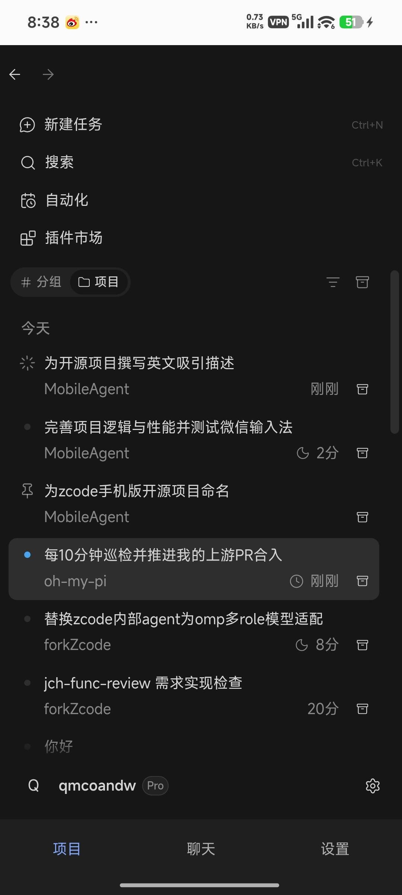
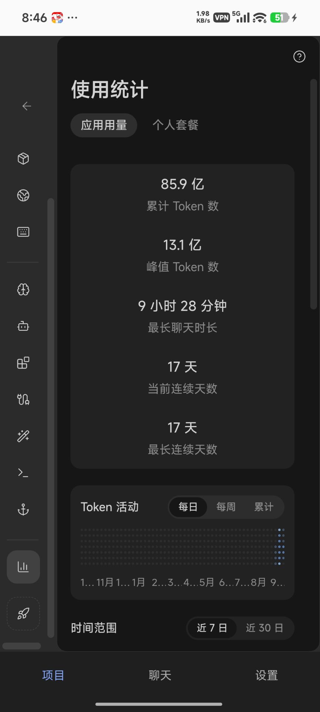
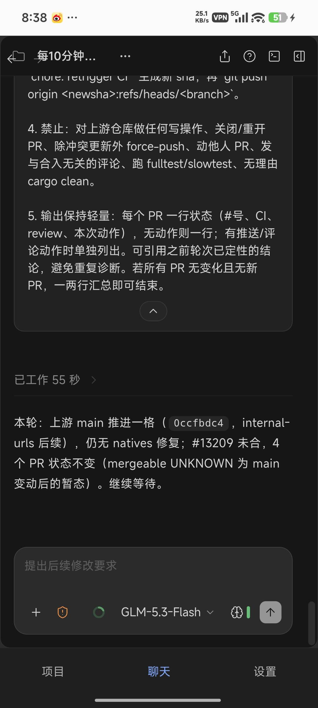
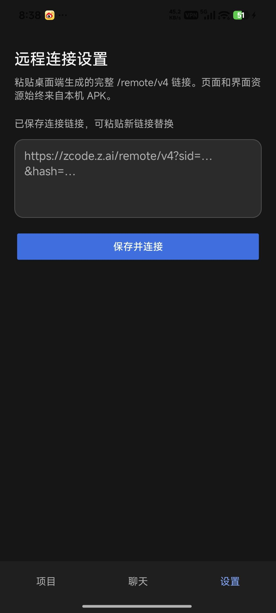
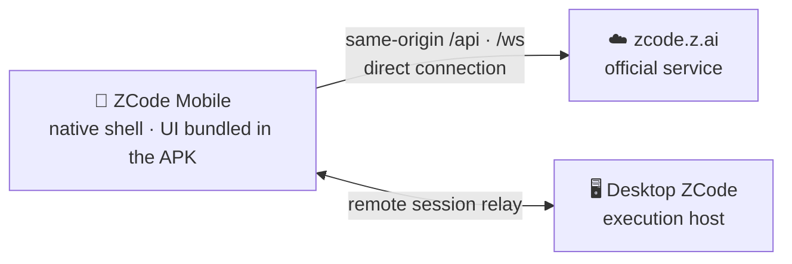

<div align="center">
  
  <h1>ZCode Mobile</h1>
  <p><b>ZCode, in your pocket.</b><br/>The native Android app for the ZCode AI coding agent.</p>
  <p>
    <a href="https://www.android.com/"></a>
    <a href="https://capacitorjs.com"></a>
    <a href="LICENSE"></a>
    <a href="https://github.com/zai-org/ZCode"></a>
  </p>
  <p>
    <a href="README.md">简体中文</a> | English
  </p>
</div>

<p align="center">
  
  &nbsp;
  
  &nbsp;
  
  &nbsp;
  
</p>

**ZCode Mobile** turns [ZCode](https://github.com/zai-org/ZCode) into a real Android app. Instead of wrangling a browser tab, you get a native shell with the entire UI bundled inside the APK: pages render from on-device assets with zero network round-trips, cold starts are instant, and scrolling stays smooth where the mobile web stumbles. Your desktop remains the execution host — your phone watches, steers, and takes over your AI coding sessions from anywhere.

> **Heads-up:** this is a community-driven, unofficial client, not affiliated with Z.ai or the ZCode team. You need your own ZCode account, and a remote session paired from the desktop app.

## ✨ Highlights

- 📦 **Zero-download UI** — the full web UI is compiled into the APK. No page fetches, no reload spinners, no "tab died in the background".
- ⚡ **Tuned for speed** — asynchronous WebView warm-up, renderer pre-warm, and preconnect/QUIC hints to the official domain make cold start and first paint fast; shipped assets have sourcemaps stripped.
- 🎯 **Direct, no middleman** — API, WebSocket, and OAuth all connect straight to `https://zcode.z.ai`. The shell never proxies, rewrites, or caches the protocol.
- 📱 **Feels native** — back-key history navigation, downloads via the system DownloadManager, keyboard insets capped at 45% of the screen, and a native Projects / Chat / Settings bottom bar.
- 🔗 **Deep-link pairing** — grab a `/remote/v4?...` link from the desktop app's remote entry and the app opens straight into that session; cold-starting from the launcher restores the last one.

## 🧭 How It Works



The WebView runs the locally bundled `packages/web` build under the official same-origin identity (`https://zcode.z.ai`): same-origin `/api` and `/ws` requests are let through by the native layer and reach the official service via the WebView network stack, while every other path is served from local assets (with SPA fallback). Nothing runs on the phone — no ZCode Server, no Agent Runtime, no Node.js. Sign-in, sessions, and data never touch a third-party server.

## 🛠️ Build It Yourself

**Requirements**

- Node.js 24 and pnpm 10 — versions are pinned in [mise.toml](mise.toml) (mise users: `mise run bootstrap`)
- JDK 21 and the Android SDK (Android Studio is the easiest way to get both)

**Build the debug APK**

```bash
git clone https://github.com/jchanghong023/zcode-mobile.git
cd zcode-mobile

# Install workspace dependencies and build the dependency chain
pnpm bootstrap

# Web production build + cap sync + Gradle assembleDebug
pnpm build:android
```

The APK lands at `apps/android/android/app/build/outputs/apk/debug/app-debug.apk`. Install it, then pair it with your desktop via a remote link. Changed the React UI? Re-run `pnpm build:android` to refresh the packaged assets.

**Development commands** (run from the repository root)

| Command                | Purpose                                        |
| ---------------------- | ---------------------------------------------- |
| `pnpm dev:web`         | Develop the Web UI in a browser                |
| `pnpm typecheck`       | Type checking                                  |
| `pnpm lint`            | Lint (`pnpm lint:fix` to auto-fix)             |
| `pnpm fmt:check`       | Format check                                   |
| `pnpm build`           | Recursively build all workspace packages       |
| `pnpm build:android`   | Build the debug APK                            |
| `pnpm verify:pre-push` | Pre-push checks (lint and architecture checks) |

## 🗂️ Repository Layout

This repository is a slimmed-down fork of [zai-org/ZCode](https://github.com/zai-org/ZCode) `v3.14.3` that keeps only the web UI build chain the Android app needs; the desktop app, server, and Agent CLI are out of scope here.

| Directory                                                                                                                   | Responsibility                                                 |
| --------------------------------------------------------------------------------------------------------------------------- | -------------------------------------------------------------- |
| `apps/android`                                                                                                              | Android host (Capacitor config, native project, build scripts) |
| `packages/web`                                                                                                              | Browser/WebView UI entry (its build output ships in the APK)   |
| `packages/ui`                                                                                                               | Shared React components, hooks, and Zustand store              |
| `packages/client`, `packages/services`, `packages/shared`, `packages/rpc`, `packages/provider`, `packages/model-option-map` | Runtime dependency chain of the UI                             |
| `scripts`, `config`                                                                                                         | Build/maintenance scripts and built-in configuration           |

## ❓ FAQ

**Does the AI run on my phone?**
No. The desktop app stays the execution host; the app reaches it through the official relay, exactly like the official remote page does.

**Where do pages load from?**
From the APK itself. Only `/api`, `/ws`, and OAuth hit the network, and they go straight to the official service.

**Is this an official ZCode product?**
No. It's an open-source community client. The "ZCode" name and related rights belong to their owner.

**What do I need to use it?**
A working ZCode account and a remote pairing link produced by the desktop app's remote entry.

## 🔎 Relationship to Upstream

- [FORK.md](FORK.md) records the upstream baseline, the effective differences from upstream, and the sync policy; [apps/android/SPEC.md](apps/android/SPEC.md) is the Android shell behavior spec.
- Upstream updates are ported selectively into the retained packages by comparison; the repository is never overwritten wholesale.

## 📄 License & Notices

- First-party code is licensed under Apache-2.0, see [LICENSE](LICENSE).
- Third-party component notices are in [THIRD-PARTY-NOTICES.md](THIRD-PARTY-NOTICES.md); risk and usage statements are in [NOTICE.md](NOTICE.md).
- No mutual guarantee is made about feature parity with the official product.
