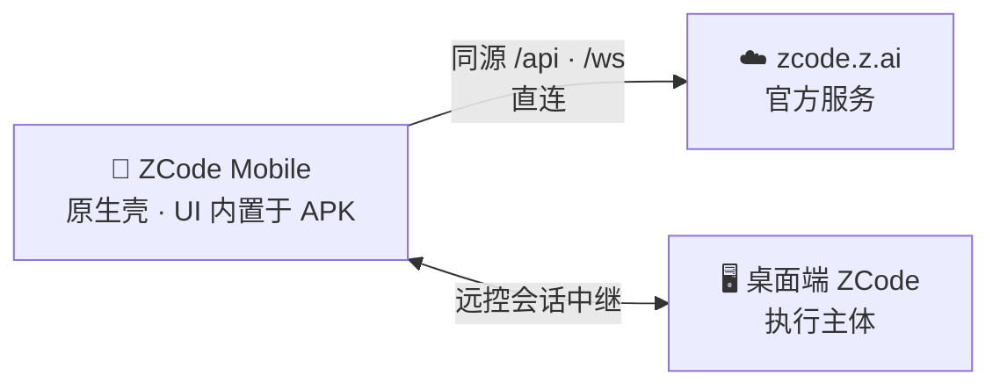

<div align="center">
  
  <h1>ZCode Mobile</h1>
  <p><b>ZCode，装进口袋。</b><br/>ZCode AI 编程代理的原生 Android 客户端。</p>
  <p>
    <a href="https://www.android.com/"></a>
    <a href="https://capacitorjs.com"></a>
    <a href="LICENSE"></a>
    <a href="https://github.com/zai-org/ZCode"></a>
  </p>
  <p>
    简体中文 | <a href="README.en.md">English</a>
  </p>
</div>

<p align="center">
  
  &nbsp;
  
  &nbsp;
  
</p>

**ZCode Mobile** 把 [ZCode](https://github.com/zai-org/ZCode) 变成一个真正的 Android App。不用再和浏览器标签页较劲：原生壳 + 完整内置的页面资源，页面从本机资产直接渲染、零网络往返，冷启动瞬间完成，滚动流畅度远超移动端网页。桌面端仍是执行主体——手机随时查看、指挥、接管你的 AI 编程会话。

> **说明**：本项目为社区驱动的非官方客户端，与 Z.ai 及 ZCode 官方无隶属关系。使用需要你自备 ZCode 账号，并已从桌面端完成远程配对。

## ✨ 亮点

- 📦 **零下载 UI** —— 完整 Web UI 编译进 APK：不拉取页面、没有刷新转圈、没有「后台标签页被杀」。
- ⚡ **为速度调优** —— WebView 异步预热、renderer 预热、官方域名 preconnect/QUIC hint，冷启动与首屏更快；APK 资产已剥离 sourcemap。
- 🎯 **直连，无中间人** —— API、WebSocket、OAuth 全部直连 `https://zcode.z.ai`；壳层不代理、不改写、不缓存协议。
- 📱 **原生手感** —— 返回键历史后退、系统 DownloadManager 下载、键盘 insets 封顶屏幕 45%、原生「项目 / 聊天 / 设置」底部导航。
- 🔗 **深链配对** —— 从桌面端「远程」入口拿 `/remote/v4?...` 链接即直达会话；图标冷启动自动恢复上一次远控链接。

## 🧭 工作原理



WebView 以官方同源身份（`https://zcode.z.ai`）运行本地打包的 `packages/web` 产物：同源 `/api`、`/ws` 由原生层放行、经 WebView 网络栈直连官方服务，其余路径全部由本地资产响应（含 SPA 回退）。手机上不运行任何东西——没有 ZCode Server、没有 Agent Runtime、没有 Node.js；登录、会话与数据不经过任何第三方服务器。

## 🛠️ 自己动手构建

**环境要求**

- Node.js 24 与 pnpm 10 —— 版本以 [mise.toml](mise.toml) 为准（mise 用户直接 `mise run bootstrap`）
- JDK 21 与 Android SDK（用 Android Studio 安装最省事）

**构建调试 APK**

```bash
git clone https://github.com/jchanghong023/zcode-mobile.git
cd zcode-mobile

# 安装 workspace 依赖并构建依赖链
pnpm bootstrap

# web 生产构建 + cap sync + Gradle assembleDebug
pnpm build:android
```

APK 输出在 `apps/android/android/app/build/outputs/apk/debug/app-debug.apk`。安装后经桌面端远控链接完成配对。修改了 React UI？重跑 `pnpm build:android` 即可随包更新。

**日常开发命令**（均在仓库根目录执行）

| 命令                   | 用途                             |
| ---------------------- | -------------------------------- |
| `pnpm dev:web`         | 浏览器中开发 Web UI              |
| `pnpm typecheck`       | 类型检查                         |
| `pnpm lint`            | Lint（`pnpm lint:fix` 自动修复） |
| `pnpm fmt:check`       | 格式检查                         |
| `pnpm build`           | 递归构建所有 workspace 包        |
| `pnpm build:android`   | 构建调试 APK                     |
| `pnpm verify:pre-push` | 提交前检查（Lint 与架构检查）    |

## 🗂️ 仓库结构

本仓库是 [zai-org/ZCode](https://github.com/zai-org/ZCode) `v3.14.3` 的精简 Fork，只保留 Android App 所需的 web UI 构建链；桌面端、Server 与 Agent CLI 不在本仓库范围内。

| 目录                                                                                                                        | 职责                                               |
| --------------------------------------------------------------------------------------------------------------------------- | -------------------------------------------------- |
| `apps/android`                                                                                                              | Android 宿主（Capacitor 配置、原生工程、构建脚本） |
| `packages/web`                                                                                                              | 浏览器/WebView UI 入口（构建产物打进 APK）         |
| `packages/ui`                                                                                                               | 共享 React 组件、hooks 与 Zustand store            |
| `packages/client`、`packages/services`、`packages/shared`、`packages/rpc`、`packages/provider`、`packages/model-option-map` | UI 的运行时依赖链                                  |
| `scripts`、`config`                                                                                                         | 构建维护脚本与内置配置                             |

## ❓ 常见问题

**AI 是在手机上运行的吗？**
不是。桌面端始终是执行主体，App 经官方中继连接桌面端，与官方远控页面完全一致。

**页面从哪里加载？**
从 APK 内置资产加载。只有 `/api`、`/ws` 和 OAuth 走网络，且全部直连官方服务。

**这是官方产品吗？**
不是。这是开源社区客户端。「ZCode」名称及相关权利归其权利人所有。

**使用前需要准备什么？**
一个可用的 ZCode 账号，以及桌面端「远程」入口生成的配对链接。

## 🔎 与上游的关系

- [FORK.md](FORK.md) 记录上游基线、相对上游的有效差异与同步策略；[apps/android/SPEC.md](apps/android/SPEC.md) 是 Android 壳层行为规格。
- 上游更新时按需把保留包的改动对照搬运进本仓库，不做整仓覆盖。

## 📄 许可与声明

- 第一方代码依照 [LICENSE](LICENSE) 采用 Apache-2.0。
- 第三方组件声明见 [THIRD-PARTY-NOTICES.md](THIRD-PARTY-NOTICES.md)；风险与使用声明见 [NOTICE.md](NOTICE.md)。
- 与官方产品的功能范围不做互相保证。
